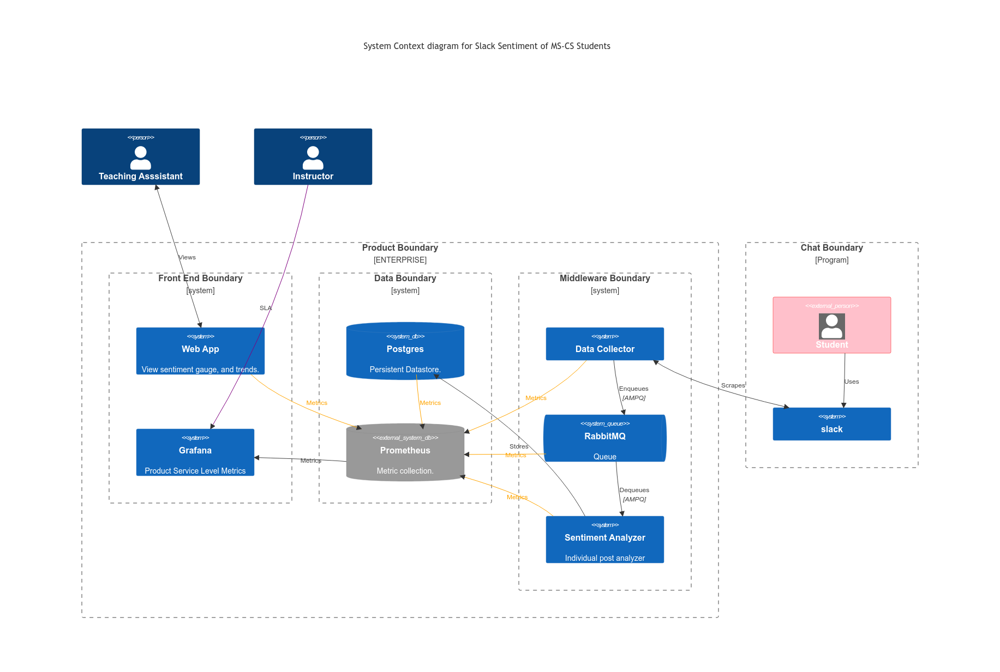
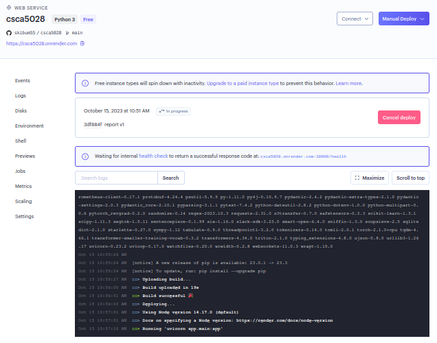
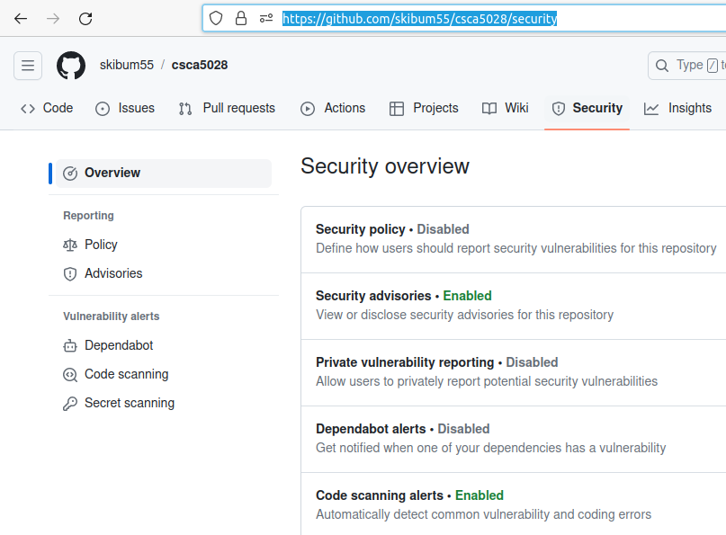
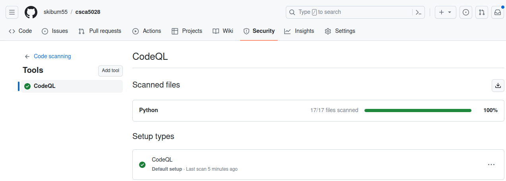

# Student Sentiment Analysis

## Executive Summary

As education moves away from mandatory classroom attendance, educators need to have a broader toolbox for fostering engagement.  Forums and chats provide an opportunity to gauge the learners feelings about the course.  This MVP application gives instructors, and their assistants, real-time insight into student sentiment.  This fast feedback encourages immediate adaptation in the case of misunderstandings while providing opportunities for future improvement.

## Initial Architecture Thoughts

[Mermaid](https://mermaid.live/) was used to create a diagram as [code](./images/Mermaid-Product-Architecture.txt).



## Quick Start

Install the prerequisites, initialize environment variables and create a dedicated environment with ``` make install ```.  Be patient as there are a number of large data science libraries which need to load.

> :warning:  ```.env``` needs to be updated with your information from the ```.env.example```

Run the application with ``` make run ```.  The homepage will be available here ->  [0.0.0.0:8000](http://0.0.0.0:8000). The first run will create a database and load a large public sentiment analysis model from [Hugging Face](https://huggingface.co/).  Any messages not in the database will be collected and analyzed at this point too.

## TL;DR

Source code is available at [Github](https://github.com/skibum55/csca5028) (minus credentials.)

### Stories Delivered
	
##### Web application basic form, reporting ✅

I chose the python [FastTAPI](https://fastapi.tiangolo.com/) framework as the basis for this application.  [Plotly](https://plotly.com/) is used for the data visualization.

##### Docs

This README serves as the Product development history.  The OpenAPI spec is available [here](./docs/openapi.json). When the application is running, the local [url](http://127.0.0.1:8000/docs#/) can be used.  A Redoc version can be found [here](http://127.0.0.1:8000/redoc).

##### Data persistence ✅

A [SQLite](https://www.sqlite.org/index.html) database was chosen for it's simplicity and portability.  A DB instance and tables are created on startup if they don't already exist.

##### Data collection ✅  

The data collector module uses the Slack Web [API](https://api.slack.com/web) to pull messages from specific channels into the DB.  You can run a new collection using the [collect](http://0.0.0.0:8000/collect) endpoint.

##### Data analyzer ✅

Data analysis is provided by the [Flair](flairnlp.github.io/) Natural Language Processing library.  It is wrapped by an FastAPI endpoint for inter-process communication. You can run a text analysis using the [analyze](http://0.0.0.0:8000/analuze) endpoint. See the [docs](http://127.0.0.1:8000/docs#/) for usage.

##### Unit tests ✅

Unit tests can be found in the [test](./test/) directory.  They can be run with the command ``` make test ``` .


##### Rest collaboration internal or API endpoint ✅

External collaboration occurs with the database and Slack API. Internally, the analysis and metrics endpoints are created using asynchronous applications with their own API specifications.

##### Product environment ✅ 

Python [Venv](https://docs.python.org/3/library/venv.html) is used for development isolation. Local credentials are not committed to source control.  For [Render](https://render.com) web services and [Github](https://github.com/) CI/D secrets and variables are used.

##### Integration tests ✅✅

Makefile ✅

##### Continuous integration ✅✅ 

[Github Actions](https://github.com/skibum55/csca5028/actions)

https://github.com/UKPLab/sentence-transformers/issues/352

##### Production monitoring instrumenting ✅✅ 

[Grafana Cloud](https://seankeery.grafana.net)

https://www.google.com/search?channel=fenc&client=firefox-b-1-lm&q=prometheus+requests+per+second

https://psychic-trout-ppq4r776r5hxg-8000.app.github.dev/metrics/

https://grafana.com/blog/2023/09/21/introducing-agentless-monitoring-for-prometheus-in-grafana-cloud/

https://seankeery.grafana.net/d/metrics-endpoint-overview/metrics-endpoint-overview?orgId=1&refresh=30s

Load Test = Integration

https://seankeery.grafana.net/a/k6-app/projects/3663881

##### Continuous delivery ✅✅✅ 

###### Codespaces & VSCode

[Codespaces](https://psychic-trout-ppq4r776r5hxg-8000.app.github.dev/)

###### Render ✅✅✅✅

A continuous deployment manifest using [Github Deploy workflows](https://github.com/skibum55/csca5028/actions/runs/6525314861/job/17717874814) can be found [here](./.github/workflows/continuous-deployment.yml).  Secrets are set using variables.  This action uses a deploy hook to deliver the app to [Render](https://dashboard.render.com).  Unfortunately my free account doesn't have capacity to run the flair sentiment analysis library in memory.  A successful delivery can be seen in the screenshot below.



##### Docker ✅✅✅✅

The docker image created in [CI](#continuous-integration-✅✅) can be run with the following commands:

```
docker pull ghcr.io/skibum55/csca5028:latest
docker run -d -p 8000:8000 --env-file=.dockerenv csca5028:latest
```

> :warning: ```.dockerenv``` needs to be updated with your information from the ```.dockerenv.example```

https://github.com/skibum55/csca5028/pkgs/container/csca5028

##### Continuous security ✅✅✅✅

Out of respect for the peer reviewers, I have added security scans to the code via [Github Security](https://github.com/skibum55/csca5028/security).  This ensures I don't spread malicious software inadvertently.






### Backlog

Code tagged with *TODO*

##### Event collaboration messaging ❎❎❎

In this product, the data demands are low enough that we can do all our collection and analysis synchronously.  As Slack usage increases, it would make sense to modify our application to use a mq as shown in the architectural [diagram](#initial-architecture-thoughts).  A change to the Slack event driven [API](https://api.slack.com/events) would be better than scraping too.

##### Using mock objects or any test doubles ❎❎

Didn't get to it.

#### Development branch

Single user development doesn't really need multiple branches.  However, the CI/D actions run on every commit.  It's a waste of compute, hence energy.

#### HTML templating

As homepage expands, inline html should be replaced with templates.

#### Test coverage

Needs to be measured and increased.

#### Scheduler

As this is an MVP, scheduled collection wasn't a priority.  A _collection_ endpoint exists for triggering a manual collection.  Research indicates that this [FASTAPI Scheduler](https://pypi.org/project/fastapi-scheduler/) would be a good fit for adding this feature when needed.

##### Object relational mapping

For database provider abstraction, an ORM can be used.